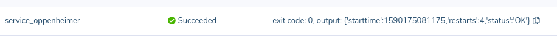
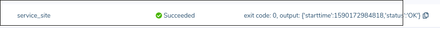

# Healthcheck with Public Device URL

Demo project of using the Docker [`HEALTHCHECK`](https://docs.docker.com/engine/reference/builder/#healthcheck) functionality for a balenaCloud project.

It's a simple web application, which has a status endpoint, through which it can signal that that the service is unhealthy. The `Dockerfile`'s `HEALTHCHECK` command will query that endpoint, and if the check fails, it will restart the service automatically:

```
HEALTHCHECK --start-period=5s --timeout=30s --interval=5s --retries=1 \
    CMD curl --silent --fail localhost:8080/status
```

Here the `--start-period`, `--timeout`, `--interval`, and `--retries` values are set to pretty short so that the demo works quickly, in your application you need to set them as appropriate (see the default values on the linked `HEALTHCHECK` docs page above).

To use this, [deploy the code on balenaCloud](https://docs.balena.io/learn/getting-started/raspberrypi3/nodejs/), enable the [Public Device URL](https://docs.balena.io/learn/manage/actions/#enable-public-device-url), and open the page, showing the service's status and provide tools to trigger an unhealthy state.

## The working page:


## Breaking things

Pressing the `Break Things` button will predictably break things inside the application, which puts the service in a state that the healthcheck will catch:


After the healthcheck kicks in, the service will be restarted in a good state, and the page will show a working state again, and the uptime will show that it was just restarted.

If logged in to the device's Host OS, `balena ps` will show the state of the containers, and whether or not they are healthy:


## View data directly from the balenaCloud dashboard

Any data exposed via the HEALTHCHECK is now directly inspectable in the balenaCloud dashboard, specifically in the
[Device Diagnostics](https://www.balena.io/blog/device-diagnostics-are-now-open-source/) section. Any output from the
HEALTHCHECK itself is passed back and added as a check, to allow users to expose their own data. Read more
[here](https://github.com/balena-io/device-diagnostics/blob/master/diagnostics.md#check_user_services):




